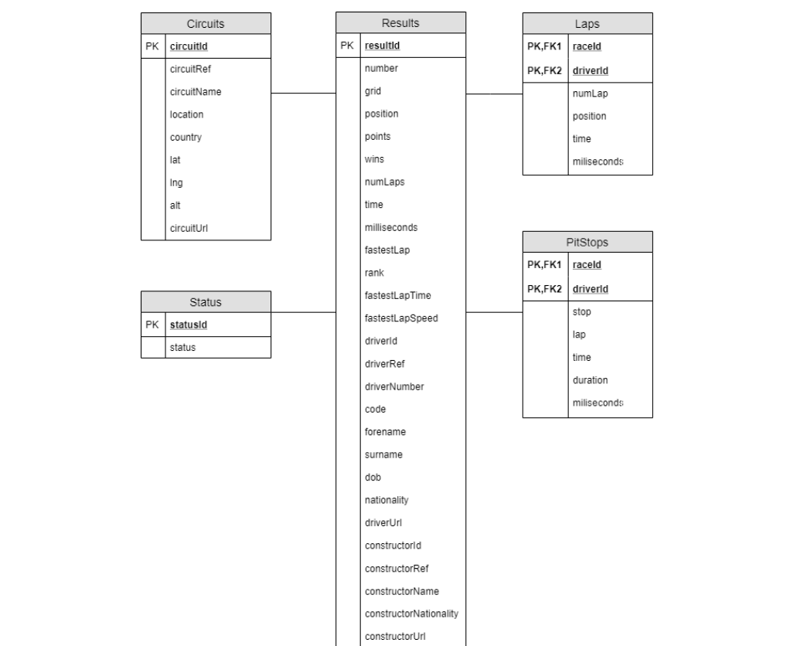

# F1OLAP
This project consits in adapt an OLTP Formula1 Database to an OLAP format and make some tests. Firstly we need to acces to a remote database in a remote server. Once the remote OLTP is we need to import it locally with a Java JDB. Next we need to create an OLAP local database and import the OLTP data with stored procedures. Finally we would realize 5 querys to check if everything is properly working

## Remote OLTP Database 

This is the remote database that we need to import locally.

## Relational Model OLAP Database

After analysing the OLTP databse we need to change orientation of our database for analtic pourposes and better performance. The way toa achieve that is using and OLAP structure. 

- Circuits, Laps, PitStops and Status tables keep being separate tables as in the OLTP
- Constructors, ConstructorResults, ConstructorStandings, Drivers, Qualify, Races, Seasons and Results merge in a single big table called Results
- By doing this structure Results table doesn't augment the number of rows in the original. If Drivers or Races were added the number of rows would be multiplied lowering the optiomization


## Extracting the Remote Database
-To extract the database we use a Java Application which follows the MVC(Model-View-Controller) structure. Firstly the controller controls the start of the RemoteConnection and the LocalConnection

```java
    private Connection remoteConnection;
    private Connection localConnection;
    
    public boolean startRemoteConnection(){
        try{
            Class.forName("com.mysql.cj.jdbc.Driver");
            remoteConnection = DriverManager.getConnection("jdbc:mysql://puigpedros.salleurl.edu/?user=" + Settings.REMOTEUSER + "&password=" + Settings.REMOTEPASSWORD + "&serverTimezone=UTC");
            return true;
        }catch(Exception e){
            e.printStackTrace();
            return false;
        }
    }

    public boolean startLocalConnection(){
        try{
            Class.forName("com.mysql.cj.jdbc.Driver");
            localConnection = DriverManager.getConnection("jdbc:mysql://localhost:3306/F1_OLTP?allowPublicKeyRetrieval=true&useSSL=false", "root", "2112");
            return true;
        }catch(Exception e){
            e.printStackTrace();
            return false;
        }
    }
```
- If the remote and local connexion is succesful we start filling the remote data to the local database with the function loadDataBaseInfo(). The name of the table we want to extract is passed as a parameter of this function

```java
    public void loadDataBaseInfo(String tableName,Model model) throws SQLException {
        ResultSet rs;
        Statement stmt;

        System.out.println("Reading remote info");

        stmt = remoteConnection.createStatement();
        stmt.executeQuery("USE F1");


        //buidem la taula de la base local
        PreparedStatement localSt = localConnection.prepareStatement("delete from " + tableName + ";");
        localSt.executeUpdate();


        //select de les dades de la base remota
        PreparedStatement remoteSt = remoteConnection.prepareStatement("select * from " + tableName + ";");
        rs = remoteSt.executeQuery();

        //extraiem la metadata i d'alla el numero de columnes
        ResultSetMetaData rsmd = rs.getMetaData();
        int col = rsmd.getColumnCount();

        //Model modelExample;
        while (rs.next()) {
            String insert = fabricarString(tableName, col);

            System.out.println("UPDATE: " + localSt);

            localSt = localConnection.prepareStatement(insert);

            for(int i=1;i<=col;i++){
                //inserim el valor de cada columna respectivament dins del update
                localSt.setString(i,rs.getString(i));
            }
            //executem el update
            localSt.executeUpdate();
        }
        rs.close();
        stmt.close();

    }
   
```
-We call this function 13 times in the main for all the tables in the remote database

```java
    
    Controller mysqlController = new Controller();
    Model model = new Model();

    System.out.println("Connecting to Database...");
    if (!mysqlController.startRemoteConnection()) System.exit(1);
    if (!mysqlController.startLocalConnection()) System.exit(1);

    System.out.println("Getting info...");
    try {
        mysqlController.loadDataBaseInfo("circuits",model);
        mysqlController.loadDataBaseInfo("pitStops",model);
        mysqlController.loadDataBaseInfo("results",model);
        mysqlController.loadDataBaseInfo("status",model);
        mysqlController.loadDataBaseInfo("races",model);
        mysqlController.loadDataBaseInfo("drivers",model);
        mysqlController.loadDataBaseInfo("driverStandings",model);
        mysqlController.loadDataBaseInfo("constructors",model);
        mysqlController.loadDataBaseInfo("constructorStandings",model);
        mysqlController.loadDataBaseInfo("constructorResults",model);
        mysqlController.loadDataBaseInfo("qualifying",model);
        mysqlController.loadDataBaseInfo("seasons",model);
        mysqlController.loadDataBaseInfo("lapTimes",model);
        
    } catch (SQLException e) {
        e.printStackTrace();
    }
   
```

